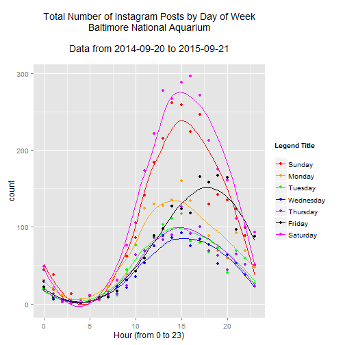
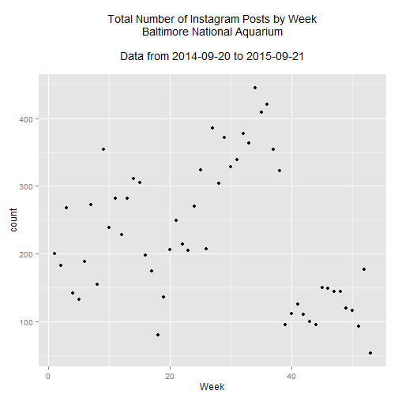

This report looks into how the number of Instagram posts made at the National Aquarium in Baltimore varies over time. The data is collected from 2014-09-20 to 2015-09-21.

# Day of Week/Hour Summary

 

A couple of things to note:

* More people make Instagram posts at the aquarium on the weekends than on weekends. 
* The number of Instagram posts peaks later in the day on Fridays, perhaps due to the extended closing time (9pm vs 5pm on other days.)

# Summary by Week

 

This is where we see a an issue with the dataset. We see a notable decline in the number of posts around September, which could probably be explained by the fact that our data collection begins in September 2014 and that Instagram use has likely increased since then.

Another thing to note on this graph is the decline in posts around week 19--that's right around the Baltimore riots of 2015.
